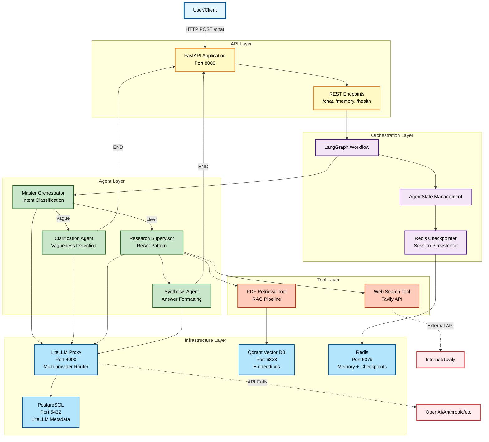

# Intelligent PDF Q&A System with Multi-Agent Architecture

Production-ready question-answering system for academic PDFs using RAG + multi-agent orchestration.

## What It Does

Ask questions about academic papers using natural language. The system autonomously routes queries through specialized agents, searches PDF content, falls back to web search when needed, and provides cited answers.

**Key Features**:
- Multi-agent orchestration (Orchestrator → Clarification/Research → Synthesis)
- RAG with vector search (Qdrant) + web search fallback (Tavily)
- Autonomous tool selection (ReAct pattern)
- Session memory for multi-turn conversations
- Centralized prompt management (Langfuse)
- LLM observability and tracing

## Quick Start

**Prerequisites**: Docker Compose, Python 3.13+, API keys (OpenAI/Anthropic, Tavily, Langfuse)

**1. Clone the repository**
```bash
git clone <repository-url>
cd test-arcfusion-2025
```

**2. Create virtual environment & install dependencies**
```bash
python3.13 -m venv venv
source venv/bin/activate  # Windows: venv\Scripts\activate
pip install -r requirements.txt
```

**3. Configure environment variables**
```bash
cp .env.template .env
```
Edit `.env` with your API keys:
- `OPENAI_API_KEY=sk-...` (required)
- `TAVILY_API_KEY=tvly-...` (required)
- `LANGFUSE_PUBLIC_KEY=pk-...` (optional)
- `LANGFUSE_SECRET_KEY=sk-...` (optional)

**4. Start all services with docker-compose**
```bash
docker-compose up -d
```

Wait for services to be ready:
```bash
curl http://localhost:8000/health
```
Expected: `{"status": "healthy"}`

**5. Upload prompts to Langfuse** (REQUIRED - first time only)
```bash
python scripts/upload_prompts_to_langfuse.py
```

**6. Ingest PDF documents**

Place your PDF files:
```bash
mkdir -p data/pdfs/papers
cp your_paper.pdf data/pdfs/papers/
```

Run ingestion:
```bash
python scripts/ingest.py
```

**7. Ask your first question**
```bash
curl -X POST http://localhost:8000/chat \
  -H "Content-Type: application/json" \
  -d '{"message": "What is the main contribution of Zhang et al. 2024?"}'
```

**Example queries:**
- PDF search: `"What prompting techniques achieved highest accuracy?"`
- Web fallback: `"What did OpenAI announce this week?"`
- Clarification: `"Tell me more about it"` → system asks for context

## Architecture



**Five Layers:**
- **API**: FastAPI REST endpoints
- **Orchestration**: LangGraph workflow with Redis checkpointing
- **Agents**: Orchestrator, Clarification, Research, Synthesis
- **Tools**: PDF retrieval (RAG) and Web search
- **Infrastructure**: LiteLLM, Qdrant, Redis, PostgreSQL

**Flow**: Query → Route (Orchestrator) → Clarify/Research → Synthesize → Respond

### Agent Descriptions

**Orchestrator Agent** ([docs](docs/agents/orchestrator/design.md))
- **Purpose**: Analyze user query intent and route to appropriate agent
- **Key Feature**: Uses LLM-based semantic routing (NO hard-coded keyword rules)
- **Decision Logic**:
  - Analyzes query clarity and context using GPT-4 reasoning
  - Detects clarification follow-ups to prevent infinite loops
  - Three-layer loop prevention: Counter limit, pattern detection, LLM decision
- **Output**: Routes to `CLARIFICATION` or `RESEARCH` agent
- **Model**: GPT-4o-mini (fast, ~100-300ms)

**Clarification Agent** ([docs](docs/agents/clarification/design.md))
- **Purpose**: Handle ambiguous or vague queries
- **Triggers**:
  - Pronouns without context ("Tell me more about it")
  - Vague terms ("How many examples are enough?")
  - Missing information ("What about accuracy?")
- **Loop Prevention**: Multi-layer protection prevents infinite clarification cycles
- **Output**: Clarifying question to gather context from user
- **Model**: GPT-4o-mini (~200-500ms)

**Research Agent** ([docs](docs/agents/research/design.md))
- **Purpose**: Autonomous multi-step research using ReAct pattern
- **Pattern**: Reasoning + Acting = Think → Act → Observe → Reflect
- **Autonomy**:
  - **Think**: Analyzes what information is needed
  - **Act**: Selects and executes tools (PDF retrieval or web search)
  - **Observe**: Evaluates tool results
  - **Reflect**: Decides if more information needed or ready to proceed
- **Tools Available**:
  - PDF Retrieval Tool (Qdrant vector search over ingested documents)
  - Web Search Tool (Tavily API for out-of-scope or time-sensitive queries)
- **Key Feature**: Agent autonomously decides when to use web search vs PDF search (NO hard-coded rules)
- **Example**: "Find SOTA in PDFs, then search web for author info" → Agent plans and executes both steps
- **Model**: GPT-4o (complex reasoning, 1-5s depending on tool calls)

**Synthesis Agent** ([docs](docs/agents/synthesis/design.md))
- **Purpose**: Format final answers with proper source attribution
- **Input**: Research observations and retrieved documents
- **Output**: Well-formatted answer with citations (e.g., "According to Zhang et al. 2024, p. 5...")
- **Additional**: Adds confidence scores and source metadata
- **Model**: GPT-4o-mini (~500-1000ms)

**See [Multi-Agent Orchestration](docs/architecture/multi-agent-orchestration.md) for detailed workflow design.**

## Documentation

**Architecture & Design**:
- [System Overview](docs/architecture/system-overview.md) - Architecture deep dive
- [Architecture Decisions](docs/architecture/architecture-decisions.md) - Tech choices, rationale, trade-offs
- [Multi-Agent Orchestration](docs/architecture/multi-agent-orchestration.md) - Agent workflows
- [Tool Provider Pattern](docs/architecture/tool-provider-pattern.md) - Extensibility design

**Components**:
- [Agents](docs/agents/README.md) - Agent design & implementations
- [RAG Strategy](docs/rag/README.md) - Retrieval implementation
- [Prompts](docs/prompts/README.md) - Centralized prompt management ⭐
- [Ingestor](docs/ingestor/README.md) - PDF ingestion pipeline
- [Evaluation](docs/evaluation/README.md) - LLM-as-a-Judge framework
- [Tools](docs/tools/README.md) - Provider pattern implementations

**API**:
- [Overview](docs/api/README.md) - REST API reference

## Tech Stack

| Component | Technology | Why |
|-----------|-----------|-----|
| **Orchestration** | LangGraph | Multi-agent workflow state machine |
| **LLM Router** | LiteLLM | Unified interface to OpenAI/Anthropic/etc |
| **Vector DB** | Qdrant | Fast semantic search for RAG |
| **Memory** | Redis | Session history + agent state |
| **PDF Parser** | Docling | Academic PDF extraction |
| **Web Search** | Tavily | Fallback for out-of-scope queries |
| **Observability** | Langfuse | Prompt management + LLM tracing |
| **API** | FastAPI | Async REST endpoints |

## Project Structure

```
src/
├── agents/          # Orchestrator, Clarification, Research, Synthesis
├── graph/           # LangGraph workflow + state
├── rag/             # Retriever, memory, service
└── apis/            # FastAPI routes

tools/               # Provider pattern (swappable implementations)
├── llm/             # LiteLLM client, Docling parser, Tavily search
├── database/        # Qdrant vector store, Redis memory
└── observability/   # Langfuse integration

prompts/             # Centralized prompt templates
ingestor/            # PDF → chunks → embeddings → Qdrant
evaluation/          # LLM-as-a-Judge framework
configs/             # YAML configs (agents, litellm, ingestor)
scripts/             # ingest.py, upload_prompts.py, run_evaluation.py
```

## Key Design Decisions

- **LangGraph**: Explicit state control for multi-agent orchestration
- **LiteLLM**: Unified interface to multiple LLM providers
- **Provider Pattern**: Swappable implementations (Qdrant, Redis, Docling, etc.)
- **Centralized Prompts**: Langfuse for versioning & observability
- **ReAct Pattern**: LLM-driven autonomous tool selection

See [Architecture Decisions](docs/architecture/architecture-decisions.md) for detailed rationale.

## How I Would Improve It in the Future

Based on the retrospective analysis in our architecture documentation, here are the planned enhancements:

### High Priority Improvements

**1. Caching System Fix** (30-50% cost reduction)
- Current: Tried LiteLLM cache but found bugs with different queries returning same cached result
- Fix: Review cache key generation, implement semantic cache as alternative
- Multi-level caching: L1 (exact match), L2 (semantic similarity), L3 (LLM response)

**2. Web Search RAG Enhancement** (Prevents context overflow)
- Current: Web search results can be very long, causing important context to be lost
- Fix: Apply RAG to web results - chunk, embed, retrieve only relevant parts
- Benefit: Focus on relevant web content, avoid context overflow

**3. Query Decomposition** (Better handling of complex queries)
- Current: Long/complex queries may lose focus
- Fix: Break complex queries into 3-5 focused sub-questions, RAG each separately, synthesize
- Benefit: Better handling of multi-part questions

### Medium Priority Improvements

**4. Semantic Chunking** (Improved retrieval quality)
- Current: Fixed token-based chunking loses semantic coherence
- Fix: Use sentence embeddings to identify natural breakpoints, keep related sentences together
- Tools: semantic-text-splitter, custom embedding-based chunker

**5. Model Experiment Suite** (Data-driven optimization)
- Current: Hard to compare performance when changing configurations
- Fix: Create experiment tracking to compare RAG approaches, models, chunking strategies, retrieval parameters
- Benefit: A/B testing and data-driven decision making

**6. Graph RAG Implementation** (Better entity/keyword retrieval)
- Current: Traditional vector RAG struggles with entity/relationship queries
- Fix: Build knowledge graph from PDFs, combine graph traversal + vector search
- Tools: Neo4j, LangChain Graph modules, Microsoft GraphRAG
- Benefit: Better for queries like "What did Zhang et al. cite?"

### Production-Scale Enhancements

**7. Kubernetes Architecture** (Only needed at 1000+ users)
- Horizontal Pod Autoscaling for FastAPI and LiteLLM
- StatefulSets for Redis (clustered) and Qdrant (sharded)
- Ingress Controller for load balancing
- Auto-scaling based on CPU/memory/request rate
- Benefits: High availability, auto-scaling, rolling updates with zero downtime

### What Worked Well

From our retrospective:
- **LangGraph**: Clear state management made debugging easy
- **LiteLLM**: Seamless provider switching saved us when OpenAI had outages
- **Qdrant**: Fast queries, easy Docker deployment, powerful filtering
- **ReAct Pattern**: Impressively autonomous tool selection, exceeded expectations

### What Could Be Improved

From our retrospective:
- **Docling**: Slower than expected (~30s per paper), would consider alternatives for large-scale
- **LangGraph**: Steeper learning curve for conditional edges, took time to master
- **Redis Checkpointer**: Limited documentation on error handling edge cases

**See [Architecture Decisions - Retrospective](docs/architecture/architecture-decisions.md#retrospective) for complete details.**

## Common Tasks

**Add new PDFs:**
```bash
cp paper.pdf data/pdfs/papers/ && python scripts/ingest.py
```

**Run evaluation:**
```bash
python scripts/run_llm_evaluation.py
```

**Monitor:**
- API logs: `docker-compose logs -f api`
- Qdrant: http://localhost:6333/dashboard
- Redis: http://localhost:5540
- Langfuse: https://cloud.langfuse.com