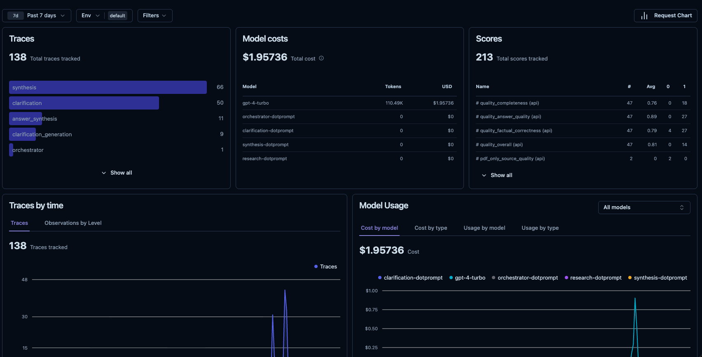
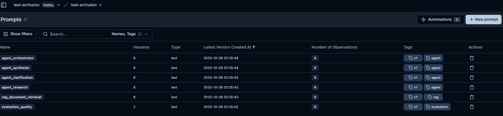
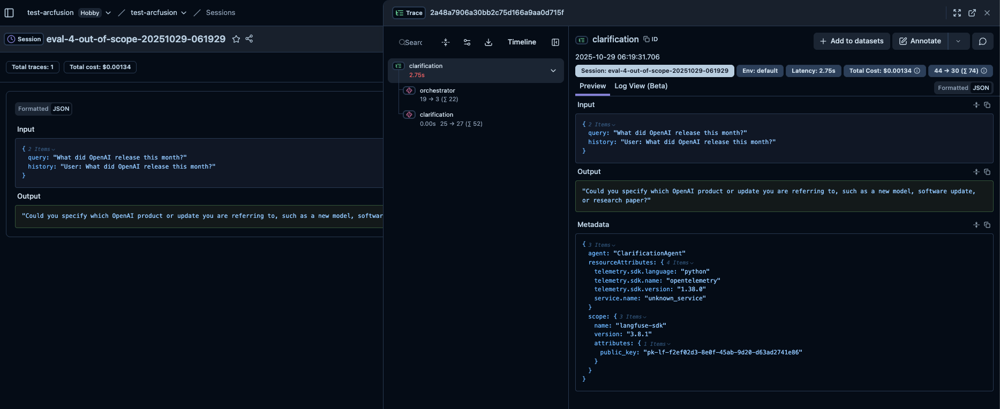

# Architecture Decisions

This document explains the key technology choices and architectural decisions for this multi-agent RAG system.

**Format**: Each decision includes context, rationale, alternatives, trade-offs, and implementation details.

---

## Quick Reference


| Component               | Technology            | Key Reason                                            | Status         |
| ------------------------- | ----------------------- | ------------------------------------------------------- | ---------------- |
| **Agent Orchestration** | LangGraph             | Explicit state control and conditional routing        | ✅ Implemented |
| **LLM Router**          | LiteLLM Proxy         | Unified interface to 100+ providers with fallbacks    | ✅ Implemented |
| **Vector Database**     | Qdrant                | Fast similarity search with payload filtering         | ✅ Implemented |
| **Memory Store**        | Redis                 | Dual-purpose: LangGraph checkpointer + session memory | ✅ Implemented |
| **PDF Parser**          | Docling (IBM)         | Handles complex layouts, tables, equations            | ✅ Implemented |
| **Web Search**          | Tavily                | AI-optimized search with cleaned content              | ✅ Implemented |
| **Observability**       | Langfuse              | LLM tracing and prompt management                     | ✅ Implemented |
| **API Framework**       | FastAPI               | Modern async Python with automatic OpenAPI docs       | ✅ Implemented |
| **Agent Pattern**       | ReAct                 | Autonomous tool selection (Reasoning + Acting)        | ✅ Implemented |
| **Prompt Management**   | File-based + Langfuse | Rapid iteration + versioning                          | ✅ Implemented |

---

## Table of Contents

1. [LangGraph for Multi-Agent Orchestration](#1-langgraph-for-multi-agent-orchestration)
2. [LiteLLM Proxy as LLM Router](#2-litellm-proxy-as-llm-router)
3. [Qdrant for Vector Database](#3-qdrant-for-vector-database)
4. [Redis for Dual Purpose (Memory + Checkpointing)](#4-redis-for-dual-purpose)
5. [Docling for PDF Parsing](#5-docling-for-pdf-parsing)
6. [Tavily for Web Search](#6-tavily-for-web-search)
7. [Langfuse for Observability](#7-langfuse-for-observability)
8. [FastAPI for REST API](#8-fastapi-for-rest-api)
9. [ReAct Pattern for Research Agent](#9-react-pattern-for-research-agent)
10. [File-Based Prompt Management](#10-file-based-prompt-management)

---

## 1. LangGraph for Multi-Agent Orchestration

### The Problem

Multi-agent systems need:

- Explicit control over agent routing and state
- Conditional routing based on agent outputs (e.g., orchestrator → clarification OR research)
- Ability to pause/resume workflows across requests
- Clear visibility into workflow execution for debugging
- Support for loops and cycles (e.g., clarification retry with loop prevention)

### The Solution

Use **LangGraph StateGraph** for orchestration instead of LangChain AgentExecutor or custom logic.

**What it is**: State machine framework built on LangChain with explicit state management and conditional routing.

### Why We Chose LangGraph

1. **Explicit State Control**: State passed between agents explicitly via TypedDict, not hidden in framework
2. **Conditional Routing**: Easy to define conditional edges based on agent decisions
   ```python
   workflow.add_conditional_edges(
       "orchestrator",
       route_after_orchestrator,
       {"clarification": "clarification", "research": "research"}
   )
   ```
3. **Persistence**: Built-in Redis checkpointer for saving/resuming workflows across requests
4. **Debugging**: Graph visualization, state inspection at each node, clear execution trace
5. **Flexibility**: Support for loops, cycles, human-in-the-loop patterns
6. **Production-Ready**: Used by companies building multi-agent systems at scale

### Trade-offs

**Advantages:**

- Clear separation of concerns (routing vs execution logic)
- Testable agents (unit test each node independently)
- Resumable workflows via checkpointing
- Visual graph representation for documentation
- Native LangChain integration

**Disadvantages:**

- Learning curve (more complex than AgentExecutor)
- More verbose code (explicit edges, routing functions)
- Newer API (less community examples than older LangChain patterns)
- Requires understanding of graph concepts

### Implementation

**Code:** `src/graph/workflow.py:97`

**Graph Structure:**

```
Entry → Orchestrator → [Clarification | Research] → [END | Synthesis] → END
```

**Configuration:** `configs/agents/langgraph.yaml`

**Documentation:** [architecture/multi-agent-orchestration.md](multi-agent-orchestration.md)

---

## 2. LiteLLM Proxy as LLM Router

### The Problem

Production LLM applications need:

- Support for multiple providers (OpenAI, Anthropic, Google, etc.)
- Automatic fallbacks when primary provider fails
- Retry logic with exponential backoff for transient failures
- Rate limiting and cost tracking
- Unified interface to avoid provider-specific code throughout codebase

### The Solution

Use **LiteLLM Proxy** as a centralized LLM gateway instead of direct provider APIs.

**What it is**: Centralized gateway providing OpenAI-compatible API for 100+ LLM providers.

### Why We Chose LiteLLM Proxy

1. **Multi-Provider Support**: Single interface for OpenAI, Anthropic, Google Gemini, and 100+ others
2. **Automatic Fallbacks**: Configure backup models if primary fails (e.g., gpt-4 → claude-3.5)
3. **Built-in Retries**: Exponential backoff and retry logic out of the box
4. **Cost Tracking**: Monitor token usage and costs per model/user
5. **Centralized Config**: Change models via YAML without code changes
6. **Load Balancing**: Round-robin across multiple API keys
7. **Production Battle-Tested**: Used by Uber, DoorDash, and other companies at scale

### Alternatives Considered


| Alternative                | Pros                          | Cons                                                  | Why Not?                                         |
| ---------------------------- | ------------------------------- | ------------------------------------------------------- | -------------------------------------------------- |
| **Direct Provider APIs**   | Simple, no proxy              | Hard-coded provider, no fallbacks, manual retry logic | Single provider lock-in, no operational features |
| **LangChain LLMs**         | Rich ecosystem, agent support | Complex abstractions, higher latency                  | Too much overhead for simple completions         |
| **LiteLLM SDK (no proxy)** | No proxy service needed       | No centralized config, harder monitoring              | Harder to share configuration across services    |
|                            |                               |                                                       |                                                  |

### Trade-offs

**Advantages:**

- Response caching via Redis (reduces redundant LLM calls)
- No code changes needed to switch providers
- Automatic handling of rate limits and retries
- Unified API format across all providers
- Centralized monitoring and cost tracking

**Disadvantages:**

- Additional service dependency (LiteLLM proxy)
- Additional latency hop through proxy (~10-50ms)
- Extra infrastructure complexity (proxy + optional PostgreSQL for logs)
- Requires monitoring of proxy health

### Implementation

**Service:** LiteLLM proxy running on port 4000

**Configuration:** `configs/litellm/proxy_config.yaml`

**Code:** `tools/llm/client/litellm/main.py:1`

**Documentation:** [tools/llm/client/design.md](../tools/llm/client/design.md)

---

## 3. Qdrant for Vector Database

### The Problem

RAG systems need:

- Fast semantic similarity search over embeddings (sub-second latency)
- Metadata filtering before vector search (e.g., "only papers from 2024")
- Payload storage (store text chunks with embeddings)
- Scalability to 100K+ document chunks
- Docker-friendly deployment

### The Solution

Use **Qdrant** vector database for semantic search and document storage.

**What it is**: High-performance vector database with built-in filtering and payload support.

### Why We Chose Qdrant

1. **Fast Search**: Sub-100ms for millions of vectors using HNSW indexing
2. **Payload Filtering**: Filter by metadata before vector search (e.g., `{"source": "paper.pdf"}`)
3. **Payload Storage**: Store full text chunks with embeddings (no separate database needed)
4. **Easy Setup**: Single Docker container, simple REST API, Python SDK
5. **Production-Ready**: Used by Bosch, Oracle, Nasdaq for vector search
6. **Open Source**: Self-hosted, no vendor lock-in
7. **Rust Performance**: Rust-based for high throughput and low latency

### Alternatives Considered


| Alternative  | Pros                      | Cons                                              | Why Not?                            |
| -------------- | --------------------------- | --------------------------------------------------- | ------------------------------------- |
| **Pinecone** | Fully managed, scalable   | SaaS-only, vendor lock-in, cost scales with usage | Can't self-host, ongoing costs      |
| **Weaviate** | Feature-rich, GraphQL API | Heavier resource usage, more complex setup        | Overkill for our needs              |
| **ChromaDB** | Simple, Python-native     | Good for prototyping, less battle-tested          | Less mature for production          |
| **FAISS**    | Fast, battle-tested       | No metadata filtering, no persistence out of box  | Would need to build filtering layer |
| **Milvus**   | Enterprise-grade          | Heavier infrastructure, more complex to operate   | Too complex for our scale           |

### Trade-offs

**Advantages:**

- Fast similarity search with HNSW indexing
- Rich metadata filtering capabilities
- Easy Docker deployment (single container)
- Open-source with active development
- No vendor lock-in

**Disadvantages:**

- In-memory mode = data lost on restart (requires re-ingestion)
- Higher memory usage than FAISS
- Smaller community compared to some alternatives
- Manual scaling configuration needed

### Implementation

**Service:** Qdrant running on port 6333 (REST), 6334 (gRPC)

**Configuration:**

```yaml
# docker-compose.yml
qdrant:
  image: qdrant/qdrant:latest
  ports:
    - "6333:6333"
  volumes:
    - qdrant_storage:/qdrant/storage  # Enable for persistence
```

**Code:** `src/rag/retriever/document_retriever.py:12`

**Documentation:** [tools/database/vector/qdrant/api-reference.md](../tools/database/vector/qdrant/api-reference.md)

---

## 4. Redis for Dual Purpose

### The Problem

Multi-agent systems need:

- **LangGraph State Persistence**: Save/resume workflows across requests
- **Session Memory**: Store conversation history for multi-turn dialogs
- Fast read/write (<10ms latency)
- TTL-based expiration for automatic cleanup
- Concurrent access from multiple API instances

### The Solution

Use **Redis** for both session-based conversation memory AND LangGraph checkpointing.

**What it is**: In-memory key-value store with persistence, TTL, and fast access.

### Why We Chose Redis

1. **LangGraph Checkpointer**: Official Redis checkpointer for LangGraph state persistence
2. **Session Memory**: Fast storage for conversation history with automatic TTL expiration
3. **Dual Purpose**: One service for both use cases (reduces infrastructure complexity)
4. **Sub-millisecond Latency**: Fast reads/writes for real-time applications
5. **TTL Support**: Automatic expiration for session cleanup (e.g., 24 hour TTL)
6. **Production-Ready**: Industry-standard caching and session store
7. **Scalable**: Redis Cluster available for horizontal scaling

### Alternatives Considered


| Use Case            | Alternative    | Why Not?                                         |
| --------------------- | ---------------- | -------------------------------------------------- |
| **LangGraph State** | PostgreSQL     | Slower than Redis, overkill for temporary state  |
| **LangGraph State** | In-memory dict | Lost on restart, not shared across API instances |
| **Session Memory**  | MongoDB        | Slower than Redis for simple key-value storage   |

### Trade-offs

**Advantages:**

- Fast in-memory operations (sub-millisecond)
- Simple key-value model (easy to reason about)
- TTL for automatic cleanup (no manual session deletion)
- Wide ecosystem support
- Can be shared across multiple API instances

**Disadvantages:**

- In-memory = requires sufficient RAM
- Data loss on crash without persistence (AOF/RDB can be enabled)
- Additional service dependency
- Not designed for complex queries (use SQL for that)

### Implementation

**Service:** Redis running on port 6379

**LangGraph Checkpointer:**

```python
from langgraph.checkpoint.redis import RedisSaver
checkpointer = RedisSaver(redis_client=redis_client)
```

**Session Memory:**

```python
# Store conversation history
memory.add(session_id="user-123", role="user", content="What is RAG?")
history = memory.get(session_id="user-123", limit=10)
```

**Code:**

- LangGraph checkpointer: `src/graph/workflow.py:82`
- Session memory: `tools/database/memory/redis/main.py`

**Documentation:** [tools/database/memory/redis/api-reference.md](../tools/database/memory/redis/api-reference.md)

---

## 5. Docling for PDF Parsing

### The Problem

Academic PDFs require:

- Text extraction with layout preservation (multi-column papers)
- Table detection and extraction
- Equation handling
- Metadata extraction (title, author, sections)
- Reasonable processing speed (<1min per paper)

### The Solution

Use **IBM Docling** for PDF text extraction.

**What it is**: Modern PDF parsing library with layout analysis and table extraction, designed for academic documents.

### Why We Chose Docling

1. **Academic PDF Focus**: Specifically designed for complex academic documents
2. **Layout Preservation**: Maintains document structure (headings, sections, columns)
3. **Table Extraction**: Detects and extracts tables accurately
4. **Markdown Export**: Outputs clean markdown format for chunking
5. **Open Source**: No API costs or vendor lock-in
6. **Modern Architecture**: Built for technical documents, equations, complex layouts

### Alternatives Considered


| Alternative | Pros                    | Cons                             | Why Not?                                    |
| ------------- | ------------------------- | ---------------------------------- | --------------------------------------------- |
| **PyPDF2**  | Lightweight, simple API | Poor quality for complex layouts | Struggles with multi-column academic papers |

### Trade-offs

**Advantages:**

- High-quality extraction for academic papers
- Preserves document structure for better chunking
- No external API dependencies
- Free and open-source

**Disadvantages:**

- Heavier dependency than PyPDF2
- Slower than simple extractors (~5-30s per PDF)
- Requires more compute resources
- Smaller community than some alternatives

### Implementation

**Code:** `ingestor/` module

**Usage:**

```python
from tools.llm.parser.selector import ParserSelector

parser = ParserSelector.create(provider="docling")
result = parser.parse("research_paper.pdf")
# result contains: text, metadata, pages
```

**Documentation:** [tools/llm/parser/docling/api-reference.md](../tools/llm/parser/docling/api-reference.md)

---

## 6. Tavily for Web Search

### The Problem

Research agents need:

- Real-time web search for out-of-scope or time-sensitive queries
- Clean content extraction (remove ads, navigation, boilerplate)
- AI-optimized results structured for LLM consumption
- Fast response times (1-3 seconds)

### The Solution

Use **Tavily** AI-optimized web search API.

**What it is**: Web search API that returns cleaned, structured content optimized for LLM consumption.

### Why We Chose Tavily

1. **AI-Optimized**: Content cleaned and formatted specifically for LLM usage
2. **Clean Extraction**: Automatically removes ads, navigation, boilerplate
3. **Structured Results**: Returns title, URL, snippet, and full cleaned content
4. **Simple API**: Single endpoint, easy integration with research agent
5. **Good Free Tier**: 1000 requests/month free tier for development

### Alternatives Considered


| Alternative           | Pros                       | Cons                                              | Why Not?                         |
| ----------------------- | ---------------------------- | --------------------------------------------------- | ---------------------------------- |
| **Google Search API** | Most comprehensive         | Requires custom scraping, quota limits, expensive | Need to scrape results ourselves |
| **Bing Search API**   | Microsoft-backed           | Similar to Google, requires scraping              | Extra scraping layer needed      |
| **Serper API**        | Good alternative to Tavily | No AI Assisted                                    | Similar, Tavily more AI-focused  |

### Trade-offs

**Advantages:**

- Content already cleaned for LLM consumption
- No need to build scraping infrastructure
- Structured, consistent response format
- Handles errors and timeouts gracefully

**Disadvantages:**

- Paid service (free tier: 1000 requests/month)
- Another API dependency
- Less control over search algorithm
- Content quality depends on source websites

### Implementation

**Code:** `tools/llm/websearch/tavily/main.py`

**Usage:**

```python
from tools.llm.websearch.selector import WebSearchSelector

search = WebSearchSelector.create(provider="tavily", api_key="tvly-...")
results = search.search("latest AI research 2024", max_results=5)
# Returns: [{"title": "...", "url": "...", "snippet": "...", "content": "..."}]
```

**Documentation:** [tools/llm/websearch/tavily/api-reference.md](../tools/llm/websearch/tavily/api-reference.md)

---

## 7. Langfuse for Observability

### The Problem

LLM applications need:

- Tracing of LLM calls (input, output, latency, token cost)
- Prompt versioning and management
- Debugging and error analysis
- A/B testing of prompts
- Session grouping for conversation analysis

### The Solution

Use **Langfuse** for LLM observability and prompt management.

**What it is**: LLM observability platform with prompt management, tracing, and analytics.

### Why We Chose Langfuse

1. **LLM-Specific**: Built specifically for LLM observability (not generic APM)
2. **Prompt Management**: Version prompts externally, link traces to prompt versions
3. **Session Grouping**: Group traces by conversation for debugging multi-turn dialogs
4. **Cost Tracking**: Track token usage and costs per session/user
5. **Self-Hosted**: Can run locally or use cloud version (no vendor lock-in)
6. **Open Source**: Full source code available, community-driven

### Alternatives Considered


| Alternative          | Pros                   | Cons                                | Why Not?                                   |
| ---------------------- | ------------------------ | ------------------------------------- | -------------------------------------------- |
| **LangSmith**        | LangChain-native       | LangChain-specific, tightly coupled | Want provider-agnostic solution            |
| **Weights & Biases** | ML experiment tracking | Not LLM-specific, heavier setup     | Designed for model training, not inference |

### Trade-offs

**Advantages:**

- Built for LLM use cases (prompt management, token tracking)
- Session-based tracing for conversations
- A/B testing support for prompts
- Self-hostable (data stays on your infrastructure)
- Open source

**Disadvantages:**

- Additional service to run and monitor
- Less mature than general APM tools
- Requires explicit instrumentation in code

### Example:

Cost Tracking



**Prompt**



**Session Tracing**



### Implementation

**Service:** Langfuse (optional, can use cloud or self-hosted)

**Code:**

```python
from tools.observability.selector import ObservabilitySelector

langfuse = ObservabilitySelector.create(provider="langfuse")

# Trace LLM call
langfuse.trace_generation(
    name="orchestrator_decision",
    input_data={"query": query},
    output=decision,
    model="gpt-4-turbo",
    session_id=session_id
)
```

**Documentation:** [tools/observability/langfuse/api-reference.md](../tools/observability/langfuse/api-reference.md)

---

## 8. FastAPI for REST API

### The Problem

API requirements:

- RESTful endpoints for chat, memory, health checks
- Async I/O for concurrent requests (multiple users)
- Request validation and error handling
- Auto-generated API documentation (OpenAPI/Swagger)
- Production-ready performance

### The Solution

Use **FastAPI** as the REST API framework.

**What it is**: Modern Python web framework with automatic validation and async support.

### Why We Chose FastAPI

1. **Modern Async**: Native async/await support for concurrent LLM calls
2. **Type Safety**: Pydantic models for automatic request/response validation
3. **Auto Documentation**: OpenAPI/Swagger docs generated automatically from code
4. **Fast**: Performance comparable to Node.js and Go for I/O-bound tasks
5. **Developer Experience**: Great editor support (autocomplete, type checking)
6. **Production-Ready**: Uvicorn ASGI server, proven at scale

### Alternatives Considered


| Alternative      | Pros                              | Cons                                       | Why Not?                                     |
| ------------------ | ----------------------------------- | -------------------------------------------- | ---------------------------------------------- |
| **Flask**        | Simple, mature, huge ecosystem    | Synchronous by default, no auto-validation | Would need extensions for async, validation  |
| **Django + DRF** | Full-featured, batteries included | Heavier, includes ORM we don't need        | Overkill for API-only service                |
| **Starlette**    | Lightweight, async                | Less features, more manual work            | FastAPI is built on Starlette, adds Pydantic |
| **gRPC**         | High performance, type-safe       | Not RESTful, requires code generation      | Want REST for easier testing/debugging       |

### Trade-offs

**Advantages:**

- Fast development with auto-validation (catches errors at API boundary)
- Excellent documentation generation (Swagger UI out of the box)
- Async support for non-blocking LLM calls
- Type safety with Pydantic (fewer runtime errors)
- Growing ecosystem

**Disadvantages:**

- Newer than Flask (less mature, fewer Stack Overflow answers)
- Smaller community (fewer third-party libraries)
- Learning curve for async patterns (if unfamiliar with async)
- Some edge cases not well-documented

### Implementation

**Service:** FastAPI app running on port 8000

**Code:** `src/apis/app.py`

**Example:**

```python
@router.post("/chat", response_model=ChatResponse)
async def chat(request: Request, chat_request: ChatRequest) -> ChatResponse:
    # Automatic validation via Pydantic
    # Async for non-blocking LLM calls
    result = await agent_workflow.invoke(...)
    return ChatResponse(response=result["response"])
```

**Documentation:** Interactive docs at `http://localhost:8000/docs`

---

## 9. ReAct Pattern for Research Agent

### The Problem

Research agent needs to:

- Autonomously decide between PDF search, web search, or both
- Chain multiple tool calls (PDF → observe → Web → observe)
- Handle failures and retry with different approach
- Explain reasoning for observability and debugging

### The Solution

Use **ReAct (Reasoning + Acting) pattern** via LangChain's `create_agent`.

**What it is**: Agent pattern where LLM alternates between reasoning (thinking) and acting (tool use).

### Why We Chose ReAct

1. **Autonomy**: Agent decides which tools to use based on query (no hard-coded rules)
2. **Multi-step**: Can chain multiple tool calls with observations
3. **Reflection**: Agent evaluates results and decides next action
4. **Transparency**: Reasoning traces visible in logs for debugging
5. **Flexibility**: Can adapt strategy mid-execution based on observations
6. **Well-Proven**: ReAct pattern proven effective in research (Yao et al. 2022)

### ReAct Loop Example

```
Think: "Query is about recent techniques, need both PDF + Web"
Act: Execute PDFRetrievalTool
Observe: "Found some papers, but need latest info"
Think: "Should also check web for recent updates"
Act: Execute WebSearchTool
Observe: "Have sufficient information"
Think: "Done, move to synthesis"
```

### Alternatives Considered


| Alternative                | Pros                               | Cons                               | Why Not?                           |
| ---------------------------- | ------------------------------------ | ------------------------------------ | ------------------------------------ |
| **Hard-coded routing**     | Simple, predictable, deterministic | No autonomy, requires rule updates | Can't adapt to new query types     |
| **LLM function calling**   | Structured output, fast            | Single-turn only, no reflection    | Can't chain tools or retry         |
| **Chain-of-Thought (CoT)** | Good reasoning                     | No tool execution                  | Just thinking, no acting           |
| **Plan-and-Execute**       | Upfront planning                   | Rigid, can't adapt mid-execution   | Can't adjust based on observations |

### Trade-offs

**Advantages:**

- Autonomous tool selection (no hard-coded rules to maintain)
- Handles complex multi-step queries naturally
- Self-correcting (can retry failed approaches)
- Explainable reasoning (can see thought process)

**Disadvantages:**

- Non-deterministic (LLM decides strategy, can vary)
- Potentially more expensive (multiple LLM calls in loop)
- Can get stuck in loops (requires max_iterations limit)
- Harder to predict exact behavior than rule-based system

### Implementation

**Code:** `src/agents/research.py:81`

**Configuration:**

```yaml
# configs/agents/langgraph.yaml
research_agent:
  max_iterations: 15
  tools:
    - pdf_retrieval
    - web_search
```

**Documentation:** [agents/research/design.md](../agents/research/design.md)

---

## 10. File-Based Prompt Management

### The Problem

Prompts are critical to LLM system behavior and require frequent iteration:

- Rapid iteration without code deployments
- Version tracking for reproducibility and auditing
- A/B testing capability
- Team collaboration (non-engineers can iterate)
- Observability (link prompts to outcomes and traces)

### The Solution

Use **file-based prompts with Langfuse integration** instead of hard-coding prompts in Python.

**What it is**: Prompts stored as `.prompt` files with YAML frontmatter, uploaded to Langfuse for versioning.

### Why We Chose File-Based + Langfuse

1. **Version Control**: Git tracks prompt evolution, Langfuse tracks runtime usage
2. **Rapid Iteration**: Update prompts in minutes without code changes or deployments
3. **A/B Testing**: Easy to test multiple prompt versions simultaneously
4. **Collaboration**: Non-engineers can propose improvements via Git PRs
5. **Observability**: Langfuse links prompts to traces, latency, success rates
6. **Reproducibility**: Every request traces back to exact prompt version
7. **Governance**: Audit trail of who changed what and when

### File Format

```yaml
---
model: gpt-4-turbo
temperature: 0.3
---
You are an intent classifier for a RAG system...

User Query: {{ query }}
Conversation History: {{ history }}

Classify the intent as: RESEARCH or CLARIFICATION
```

### Directory Structure

```
prompts/
├── agent/orchestrator/v1.prompt
├── agent/clarification/v1.prompt
├── agent/research/v1.prompt
├── agent/synthesis/v1.prompt
├── rag/document_retrieval/v1.prompt
└── evaluation/quality/v1.prompt
```

### Alternatives Considered


| Alternative                  | Pros                     | Cons                                               | Why Not?                             |
| ------------------------------ | -------------------------- | ---------------------------------------------------- | -------------------------------------- |
| **Hard-coded in code**       | Simple, no extra tooling | Slow iteration, deployment required, no versioning | Can't iterate quickly                |
| **Database-stored**          | Centralized, dynamic     | Complex infrastructure, no Git history             | Lose version control benefits        |
| **Prompt management SaaS**   | Feature-rich, hosted     | Vendor lock-in, ongoing cost                       | Don't want dependency on third-party |
| **Langfuse only (no files)** | Centralized              | No Git history, harder collaboration               | Want Git as source of truth          |

### Trade-offs

**Advantages:**

- Prompt changes don't require code deployment
- Non-engineers can iterate on prompts
- Full version history in Git + runtime tracking in Langfuse
- A/B testing without code changes
- Clear separation of concerns (prompts vs code)

**Disadvantages:**

- Extra upload step required (`python scripts/upload_prompts_to_langfuse.py`)
- File format must be maintained (`.prompt` with YAML frontmatter)
- Requires Langfuse setup for full benefits (optional but recommended)

### Implementation

**Code:**

- Upload script: `scripts/upload_prompts_to_langfuse.py`
- Prompt config: `prompts/config.py`

**Usage:**

```python
# Load prompt from Langfuse
prompt = langfuse.get_prompt("agent_orchestrator", label="production")
compiled = prompt.compile(query=user_query, history=chat_history)
```

**Documentation:** [prompts/README.md](../prompts/README.md)

---

## Decision Principles

The technology choices in this system follow these principles:

1. **Production-First**: Choose battle-tested technologies used at scale
2. **Operational Excellence**: Prioritize built-in features (retries, fallbacks, monitoring)
3. **Developer Experience**: Clear APIs, good documentation, strong typing
4. **Cost-Effective**: Optimize for cost where possible (embeddings, caching)
5. **Open Source**: Prefer self-hosted solutions to avoid vendor lock-in
6. **Flexibility**: Use abstraction patterns to enable swapping implementations

---

## Retrospective

### What Worked Well

1. **LangGraph**: Clear state management made debugging easy
2. **LiteLLM**: Seamless provider switching saved us when OpenAI had outages
3. **Qdrant**: Fast queries, easy Docker deployment, powerful filtering
4. **ReAct Pattern**: Impressively autonomous tool selection, exceeded expectations

### What Could Be Improved

1. **Docling**: Slower than expected (~30s per paper), would consider alternatives for large-scale
2. **LangGraph**: Steeper learning curve for conditional edges, took time to master
3. **Redis Checkpointer**: Limited documentation on error handling edge cases

### Future Enhancements

#### ⭐ Model Experiment Suite

**Problem**: Hard to compare performance when changing configurations

**Proposed Solution**:

- Create experiment tracking system to compare different:
  - RAG approaches (vector-only vs hybrid vs graph RAG)
  - Models for each agent (GPT-4 vs Claude vs Gemini)
  - Chunking strategies
  - Retrieval parameters (top_k, similarity threshold)

**Implementation**:

```python
# experiments/config.yaml
experiments:
  - name: "gpt4-vs-claude-orchestrator"
    variants:
      - model: "gpt-4-turbo"
      - model: "claude-3-5-sonnet"
    metrics: ["accuracy", "latency", "cost"]
```

**Benefit**: Data-driven decision making, easy A/B testing

---

#### ⭐ Advanced Chunking Methods

**Problem**: Fixed token-based chunking loses semantic coherence

**Proposed Solutions**:

1. **Semantic Chunking**:

   - Use sentence embeddings to identify natural breakpoints
   - Keep related sentences together based on semantic similarity
   - Tools: `semantic-text-splitter`, custom embedding-based chunker
2. **Multi-Stage Chunking**:

   - **Document Ingestion**: Semantic chunking during PDF processing
   - **Pre-RAG Chunking**: Further split long chunks before retrieval if needed

**Benefit**: Better context preservation, improved retrieval quality

---

#### ⭐ Query Decomposition for Long Queries

**Problem**: Long queries may exceed context limits or lose focus in RAG

**Proposed Solution**:

```python
# Decompose complex query into sub-queries
def decompose_query(long_query: str) -> list[str]:
    sub_queries = llm.generate(
        f"Break this into 3-5 focused sub-questions: {long_query}"
    )
    return sub_queries

# RAG each sub-query separately
results = []
for sub_query in sub_queries:
    results.extend(rag.retrieve(sub_query, top_k=3))

# Combine and synthesize
final_answer = synthesize_from_multiple_retrievals(results)
```

**Benefit**: Better handling of complex, multi-part questions

---

#### ⭐ Graph RAG Implementation

**Problem**: Traditional vector RAG struggles with keyword/entity retrieval

**Proposed Solution**:

- Build knowledge graph from PDFs (extract entities, relationships)
- Combine graph traversal + vector search
- Better for queries like "What did Zhang et al. cite?" or "Papers mentioning BERT"

**Tools**: Neo4j, LangChain Graph modules, Microsoft GraphRAG

**Benefit**: Better retrieval for entity-based and relational queries

---

#### ⭐ Caching System Improvements

**Current Issue**: Tried LiteLLM cache (beta) but found bug - different queries returning same cached result

**Proposed Solutions**:

1. **Fix LiteLLM Cache Setup**:

   - Review cache key generation (ensure query uniqueness)
   - Check Redis key format and TTL settings
   - Test with different query variations
2. **Semantic Cache (Alternative)**:

   - Cache by embedding similarity (not exact match)
   - Use cosine similarity threshold (e.g., >0.95 = cache hit)
   - Avoids exact match limitations
3. **Multi-Level Caching**:

   - L1: Exact query match (Redis)
   - L2: Semantic similarity match (Qdrant)
   - L3: LLM response cache

**Benefit**: 30-50% cost reduction when working correctly

---

#### ⭐ Web Search RAG Enhancement

**Problem**: Web search results can be very long, causing important context to be lost

**Proposed Solution**:

```python
# Apply RAG to web search results
def web_search_with_rag(query: str):
    # 1. Get web results
    web_results = tavily.search(query, max_results=10)

    # 2. Chunk and embed web content
    chunks = []
    for result in web_results:
        chunks.extend(chunk_text(result['content']))

    embeddings = llm.embed([c['text'] for c in chunks])

    # 3. Store temporarily in vector store
    vector_store.add(embeddings, chunks, collection="web_temp")

    # 4. Retrieve most relevant chunks only
    query_embedding = llm.embed([query])[0]
    relevant_chunks = vector_store.search(
        query_embedding,
        k=5,
        filter={"collection": "web_temp"}
    )

    return relevant_chunks
```

**Benefit**: Focus on relevant web content, avoid context overflow

---

#### ⭐ Temporal Query Awareness for Web Search

**Problem**: System returns outdated information when users ask temporal queries like "latest update from OpenAI last month"

**Current Issues**:

1. **Tavily search lacks temporal filtering**:
   - Only passes `query` and `max_results` parameters
   - No `time_range` parameter (accepts "day", "week", "month", "year")
   - Results sorted by relevance, not recency
   - Example: Query "latest OpenAI update" returns 2023 news articles

2. **Research agent has no temporal awareness**:
   - Prompt doesn't include current date context
   - No instructions on handling "last month", "recent", "latest"
   - Can't interpret relative time expressions

3. **No date context passed to agents**:
   - Agents receive messages but no current date
   - Can't distinguish between "last month" in 2023 vs 2025

**Proposed Solution**:

1. **Add temporal parameters to Tavily client** (`tools/llm/websearch/tavily/main.py`):

```python
def search(
    self,
    query: str,
    max_results: int = 5,
    time_range: Optional[str] = None,  # "day", "week", "month", "year"
    search_depth: str = "basic"         # "basic" or "advanced"
) -> list[dict[str, Any]]:
    """Search with temporal filtering."""
    response = self.client.search(
        query=query,
        max_results=max_results,
        time_range=time_range,  # Filter by recency
        search_depth=search_depth
    )
```

2. **Add current date to research prompt** (`prompts/agent/research/v1.prompt`):

```yaml
---
model: gpt-4
temperature: 0.7
---
# Context
Current date: {{ current_date }}

# Your Job
When users ask about "recent", "latest", "last month", etc.:
1. Use the current date above to interpret temporal queries
2. For Tavily searches, specify time range in query
3. Prioritize and report the most recent information
```

3. **Inject current date when compiling prompts** (`src/agents/research.py`):

```python
from datetime import datetime

system_prompt = prompt_obj.compile(
    current_date=datetime.now().strftime("%Y-%m-%d")
)
```

4. **Enhance web search tool description** (`src/agents/tools/web_search.py`):

```python
description: str = """Search the web for current information.

For temporal queries ("last month", "recent", "latest"):
- Specify time range in your query: "openai updates october 2025"
- Results will be filtered to recent timeframe

Use this tool when:
- Recent events or releases ("this month", "latest", "current")
- Information not in academic papers
...
"""
```

**Observed Issue Example**:

```bash
User Query: "what is latest update from openai last month"
Current Date: 2025-10-29

System Response (incorrect):
- Returns November 2023 information
- Sam Altman removal from OpenAI board
- GPT-3.5-Turbo update (2023)

Root Cause:
- Tavily searched without time filter → all results by relevance
- Agent constructed generic query "latest update from openai"
- 2023 articles ranked high due to relevance (major news events)
- Agent had no date context to detect outdated results
```

**Benefits**:

- ✅ Accurate temporal query handling
- ✅ Always return recent information when requested
- ✅ Better user trust (no outdated information)
- ✅ Improved agent reasoning about time-sensitive queries

---

#### ⭐ Production-Scale Kubernetes Architecture

**Problem**: Single-instance services can't handle high traffic or auto-scale

**Proposed Solution**:

**Deployment Architecture**:

```yaml
# Stateless Services (Deployment)
- FastAPI (3+ replicas, HPA enabled)
- LiteLLM Proxy (2+ replicas)

# Stateful Services (StatefulSet)
- Redis (3 replicas, clustered)
- Qdrant (3 replicas, sharded)

# Load Balancing
- Ingress Controller (Nginx/Traefik)
- Service mesh (Istio - optional)
```

**Horizontal Pod Autoscaling**:

```yaml
apiVersion: autoscaling/v2
kind: HorizontalPodAutoscaler
metadata:
  name: fastapi-hpa
spec:
  scaleTargetRef:
    apiVersion: apps/v1
    kind: Deployment
    name: fastapi
  minReplicas: 3
  maxReplicas: 20
  metrics:
  - type: Resource
    resource:
      name: cpu
      target:
        type: Utilization
        averageUtilization: 70
```

**Benefits**:

- Auto-scaling based on load (CPU/memory/request rate)
- High availability (multiple replicas)
- Rolling updates with zero downtime
- Resource optimization (scale down during low traffic)

---

### Priority Ranking

**🔴 High Priority** (Biggest Impact):

1. **Temporal Query Awareness** - Fixes incorrect temporal results (user trust issue)
2. **Caching System Fix** - 30-50% cost reduction
3. **Web Search RAG** - Prevents context overflow issues
4. **Query Decomposition** - Better handling of complex queries

**🟡 Medium Priority**:
5. **Semantic Chunking** - Improved retrieval quality
6. **Model Experiment Suite** - Data-driven optimization
7. **Graph RAG** - Better entity/keyword retrieval

**🟢 Low Priority** (Future Scale):
8. **Kubernetes Architecture** - Only needed at scale (1000+ users)

---

## Related Documentation

- [architecture/system-overview.md](system-overview.md) - How all components integrate
- [architecture/multi-agent-orchestration.md](multi-agent-orchestration.md) - Agent workflows
- [architecture/tool-provider-pattern.md](tool-provider-pattern.md) - Extensibility pattern
- [tools/README.md](../tools/README.md) - Tool implementations
- [prompts/README.md](../prompts/README.md) - Prompt management guide
