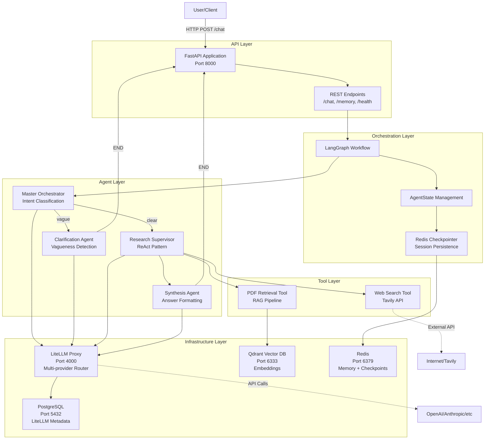

# System Architecture Overview

High-level view of how all components work together in the multi-agent RAG system.

## Table of Contents
- [System Diagram](#system-diagram)
- [Data Flow Example](#data-flow-example)
- [Technology Stack](#technology-stack)
- [Next Steps](#next-steps)

---

## System Diagram



**Five Layers:**
- **API**: FastAPI REST endpoints ([details](../api/endpoints.md))
- **Orchestration**: LangGraph workflow with Redis checkpointing ([details](multi-agent-orchestration.md))
- **Agents**: Orchestrator, Clarification, Research, Synthesis ([details](../agents/README.md))
- **Tools**: PDF retrieval (RAG) and Web search ([details](../tools/README.md))
- **Infrastructure**: LiteLLM, Qdrant, Redis, PostgreSQL

---

## Data Flow Example

### Query: "What's the state-of-the-art text-to-SQL approach?"

```
1. Client Request
   └─> POST /chat {"message": "What's the SOTA text-to-SQL approach?"}
       └─> FastAPI creates/retrieves session_id
           └─> Creates AgentState with HumanMessage

2. Orchestrator Agent
   └─> Analyzes query: "Clear and specific"
       └─> Decision: Route to Research Agent

3. Research Agent (ReAct Loop)
   │
   ├─> THINK: "Need both historical papers and recent info"
   │
   ├─> ACT: Execute PDFRetrievalTool
   │   └─> Generate query embedding
   │       └─> Qdrant cosine similarity search
   │           └─> Return top-5 chunks with metadata
   │
   ├─> OBSERVE: "Found papers from 2023-2024"
   │
   ├─> THINK: "Should check web for latest developments"
   │
   ├─> ACT: Execute WebSearchTool
   │   └─> Tavily API: "text-to-SQL SOTA 2024"
   │       └─> Return recent articles
   │
   ├─> OBSERVE: "Have comprehensive information"
   │
   └─> REFLECT: "Sufficient data, proceed to synthesis"

4. Synthesis Agent
   └─> Combines: PDF chunks + Web results
       └─> Formats: Answer with source citations
           └─> Calculates: confidence_score = 0.95

5. Response
   └─> FastAPI returns JSON:
       {
         "answer": "According to documents in your collection...",
         "sources": [],
         "session_id": "abc-123",
         "message_count": 2
       }
```

**End-to-End Latency:** ~3-7 seconds
- Orchestrator: ~200ms
- Research (PDF + Web): ~3-5s
- Synthesis: ~500ms
- Network/overhead: ~300ms

---

## Technology Stack

| Layer | Technology | Purpose | Why Chosen |
|-------|-----------|---------|------------|
| **API** | FastAPI | REST endpoints, async I/O | Performance, auto docs, type safety |
| **Orchestration** | LangGraph | Multi-agent workflows | State management, conditional routing |
| **Agents** | LangChain | Agent framework | Tool integration, message abstraction |
| **LLM Router** | LiteLLM | Multi-provider interface | Unified API, fallbacks, cost tracking |
| **Vector DB** | Qdrant | Similarity search | Fast, Python-native, easy setup |
| **Memory** | Redis | Session state, caching | Speed, TTL support, LangGraph integration |
| **Database** | PostgreSQL | Metadata, logs | Reliability, LiteLLM requirement |
| **PDF Parsing** | Docling | Text extraction | Handles complex academic PDFs |
| **Web Search** | Tavily | Real-time web search | Designed for LLM agents |
| **Observability** | Langfuse | Tracing, prompts | (Optional) LLM ops platform |

**Models Used:**
- **Orchestrator**: gpt-4o-mini (fast routing)
- **Clarification**: gpt-4o-mini (question generation)
- **Research**: gpt-4o (complex reasoning)
- **Synthesis**: gpt-4o-mini (formatting)
- **Embeddings**: text-embedding-3-small (1536-dim)

---

## Next Steps

**Dive deeper into specific components:**

| Topic | Document |
|-------|----------|
| **How agents work together** | [Multi-Agent Orchestration](multi-agent-orchestration.md) |
| **Design trade-offs** | [Architecture Decisions](architecture-decisions.md) |
| **Individual agents** | [Agent System](../agents/README.md) |
| **RAG implementation** | [RAG Strategy](../rag/retrieval-strategy.md) |
| **Tool architecture** | [Tools Module](../tools/README.md) |
| **API specification** | [API Reference](../api/endpoints.md) |
